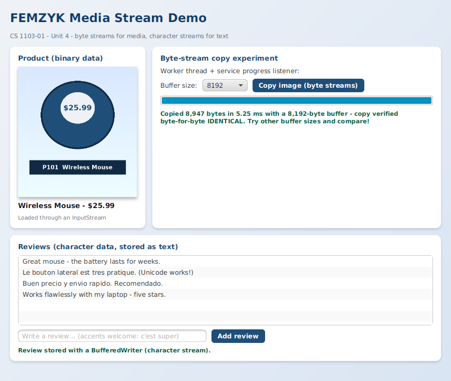
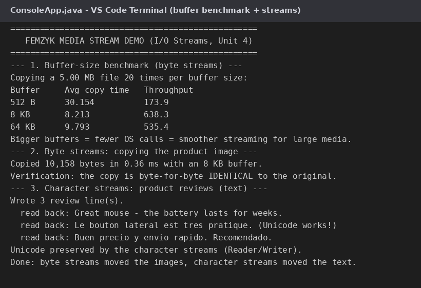

# FEMZYK Media Stream Demo

A companion demo for *CS 1103-01 – Unit 4 (I/O Streams and Applets)*, built to the same
standard as the other FEMZYK projects: a layered **core service**, a styled **JavaFX
front end**, and a **console benchmark** — showing the two stream families from the
course reading doing the jobs they are made for, in an **e-commerce multimedia** context.

🔗 **Repository:** https://github.com/FEMZYKENTLTD/FEMZYK-MediaStreamDemo



## 🌊 What it demonstrates

| Stream family | Used for | Where |
|---------------|----------|-------|
| **Byte streams** (`BufferedInputStream` / `BufferedOutputStream`) | Binary multimedia: the product image is copied in configurable chunks and verified byte-for-byte with `Files.mismatch` | `MediaStreamService.copyImage()` |
| **Character streams** (`BufferedReader` / `BufferedWriter`) | Text: product reviews stored and reloaded with Unicode (French/Spanish accents) preserved | `MediaStreamService.readReviews()` / `appendReview()` / `rewriteReviews()` |

**Bonus experiment:** the console benchmark copies a generated **5 MB media file** with
512 B, 8 KB and 64 KB buffers (20 runs each) and reports average time and throughput —
the exact trade-off (memory vs. speed vs. OS calls) behind the unit's discussion
question about buffering very large media files.

## 🧵 Threading and resource management

- GUI copies run on a **worker thread**; the UI is updated only via `Platform.runLater`,
  fed by the service's `ProgressListener` (progress bar) — the window never freezes.
- Every stream is opened in a **try-with-resources** block, so each one is closed
  automatically even on failure — clean resource management, continuing the Unit 1
  `finally` discussion.
- The output folder is created defensively before any writing starts.

## 📁 Project layout

```
FEMZYK-MediaStreamDemo/
├── pom.xml                                            Maven build file (JavaFX + plugins)
├── media/product.png                                  Sample product image (binary data)
├── docs/                                              Screenshots used by this README
└── src
    ├── main/java/com/femzyk/mediademo
    │   ├── core/MediaStreamService.java               Reusable byte/character stream logic + progress listener
    │   ├── console/ConsoleApp.java                    Buffer-size benchmark + stream demonstrations
    │   └── gui
    │       ├── Launcher.java                          Entry point of the JavaFX front end
    │       └── MediaFxApp.java                        Product page: image, copy experiment, reviews
    ├── main/resources/com/femzyk/mediademo/gui
    │   └── styles.css                                 JavaFX stylesheet
    └── test/java/com/femzyk/mediademo/gui
        └── SnapshotRunner.java                        Dev utility that captures the GUI screenshot
```

## ✅ Requirements

- **JDK 17 or newer** (built and tested on JDK 25 with JavaFX 26)
- **Maven 3.8+**
- VS Code users: the **Extension Pack for Java** extension

## 🚀 Build and run

```bash
# 1. compile and package (clean build: no errors, no warnings)
mvn clean package

# 2. run the console benchmark and stream demonstrations
java -cp target/femzyk-mediastream-demo-1.1.0.jar com.femzyk.mediademo.console.ConsoleApp

# 3. run the JavaFX front end
mvn javafx:run
```

In VS Code: open the folder with the **Extension Pack for Java** installed, then run
`Launcher.java` (GUI) or `ConsoleApp.java` (console) with **F5**.

Sample console output from a real run:

```
--- 1. Buffer-size benchmark (byte streams) ---
Copying a 5.00 MB file 20 times per buffer size:
Buffer     Avg copy time   Throughput
512 B      30.154          173.9
8 KB       8.213           638.3
64 KB      9.793           535.4

--- 2. Byte streams: copying the product image ---
Copied 10,158 bytes in 0.36 ms with an 8 KB buffer.
Verification: the copy is byte-for-byte IDENTICAL to the original.
```



## 📚 Reading

- Eck, D. J. (2022). *Introduction to programming using Java: Version 9, JavaFX edition* — Section 11.1, "I/O Streams, Readers, and Writers": https://math.hws.edu/javanotes/c11/s1.html

## Academic context

Course demo for **CS 1103-01 – AY2027-T1, Unit 4 Discussion**
(University of the People). Built with Maven and JavaFX; compiled with a clean
`BUILD SUCCESS` (no errors, no warnings).
